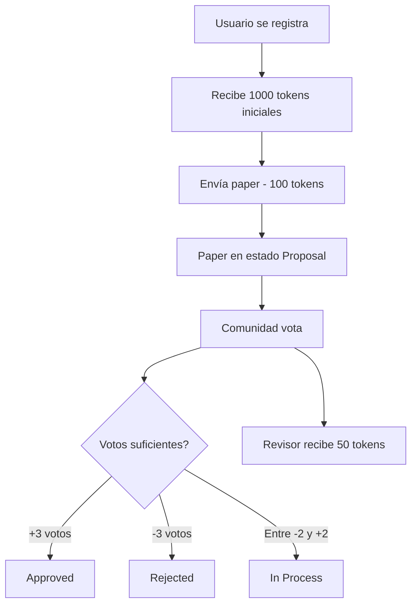

# Documentación - Plataforma Académica Descentralizada (Milo Journal)

## 📋 Índice

1. [Visión General](#visión-general)
2. [Arquitectura del Sistema](#arquitectura-del-sistema)
3. [Backend - Motoko](#backend---motoko)
4. [Frontend - React](#frontend---react)
5. [Instalación y Despliegue](#instalación-y-despliegue)
6. [API Reference](#api-reference)
7. [Casos de Uso](#casos-de-uso)
8. [Seguridad](#seguridad)
9. [Roadmap](#roadmap)

---

## 🎯 Visión General

**Milo Journal** es una plataforma descentralizada de publicación académica construida sobre Internet Computer Protocol (ICP). Permite a investigadores publicar papers, participar en peer review y ser recompensados con tokens por sus contribuciones a la comunidad científica.

### Características Principales

- ✅ **Descentralización completa** en Internet Computer
- ✅ **Sistema de peer review** comunitario
- ✅ **Economía de tokens** con incentivos
- ✅ **Estados automáticos** de papers basados en votación
- ✅ **Interface moderna** con React
- ✅ **Transparencia total** en el proceso de revisión

### Flujo de Trabajo



---

## 🏗️ Arquitectura del Sistema

### Stack Tecnológico

- **Backend**: Motoko (Internet Computer)
- **Frontend**: React + Tailwind CSS
- **Blockchain**: Internet Computer Protocol
- **Estado**: HashMap en memoria (Motoko)
- **Autenticación**: Internet Identity

### Componentes Principales

```
┌─────────────────┐    ┌─────────────────┐    ┌─────────────────┐
│   React App     │    │  Motoko Actor   │    │  IC Blockchain  │
│                 │◄──►│                 │◄──►│                 │
│  - UI/UX        │    │  - Lógica       │    │  - Persistencia │
│  - Estado Local │    │  - Validación   │    │  - Consenso     │
│  - Interacción  │    │  - Tokens       │    │  - Seguridad    │
└─────────────────┘    └─────────────────┘    └─────────────────┘
```

---

## 🔧 Backend - Motoko

### Tipos de Datos

#### PaperStatus
```motoko
public type PaperStatus = {
    #Proposal;   // Propuesta inicial
    #InProcess;  // En proceso de revisión
    #Approved;   // Aprobado por la comunidad
    #Rejected;   // Rechazado por la comunidad
};
```

#### Paper
```motoko
public type Paper = {
    id: Nat;                    // ID único del paper
    title: Text;                // Título del paper
    author: Text;               // Nombre del autor
    authorPrincipal: Principal; // Principal del autor
    content: Text;              // Contenido/abstract
    status: PaperStatus;        // Estado actual
    timestamp: Int;             // Timestamp de creación
    votes: Int;                 // Suma neta de votos
    reviewers: [Principal];     // Lista de revisores
};
```

#### User
```motoko
public type User = {
    principal: Principal;       // Principal único
    username: Text;             // Nombre de usuario
    walletAmount: Nat;          // Cantidad de tokens
    publishedPapers: [Nat];     // Papers publicados
    reviewedPapers: [Nat];      // Papers revisados
};
```

#### Vote
```motoko
public type Vote = {
    paperId: Nat;               // ID del paper votado
    voter: Principal;           // Principal del votante
    approve: Bool;              // true = aprobar, false = rechazar
    timestamp: Int;             // Timestamp del voto
};
```

### Estado del Sistema

```motoko
// Contador para IDs únicos de papers
private stable var nextPaperId: Nat = 0;

// Storage principal
private var papers = HashMap.HashMap<Nat, Paper>();
private var users = HashMap.HashMap<Principal, User>();
private var votes = HashMap.HashMap<Text, Vote>();
```

### Funciones Principales

#### Gestión de Usuarios

##### `registerUser(username: Text)`
- **Propósito**: Registra un nuevo usuario en el sistema
- **Tokens iniciales**: 1000 $INV
- **Validación**: Verifica que el usuario no esté ya registrado
- **Return**: `Result<Text, Text>`

```motoko
public shared(msg) func registerUser(username: Text) : async Result.Result<Text, Text>
```

##### `getUserInfo()`
- **Propósito**: Obtiene información del usuario autenticado
- **Return**: `Result<User, Text>`
- **Uso**: Dashboard y gestión de wallet

#### Gestión de Papers

##### `submitPaper(title: Text, content: Text)`
- **Costo**: 100 tokens
- **Estado inicial**: `#Proposal`
- **Validación**: Usuario registrado y fondos suficientes
- **Return**: `Result<Nat, Text>` (ID del paper)

##### `getAllPapers()`
- **Propósito**: Obtiene todos los papers del sistema
- **Return**: `[Paper]`
- **Uso**: Listado principal en frontend

##### `getPapersByStatus(status: PaperStatus)`
- **Propósito**: Filtra papers por estado
- **Return**: `[Paper]`
- **Uso**: Filtros en UI

#### Sistema de Votación

##### `votePaper(paperId: Nat, approve: Bool)`
- **Recompensa**: 50 tokens por voto
- **Restricciones**: 
  - No votar papel propio
  - Un voto por paper por usuario
- **Lógica**: 
  - +3 votos → Approved
  - -3 votos → Rejected
  - Entre -2 y +2 → InProcess

#### Estadísticas

##### `getSystemStats()`
- **Return**: `{totalPapers: Nat; totalUsers: Nat; approvedPapers: Nat}`
- **Uso**: Dashboard metrics

---

## 🎨 Frontend - React

### Estructura de Componentes

```
AcademicJournalApp/
├── useIC Hook                 // Conexión con Internet Computer
├── Header Component           // Navegación y wallet
├── Stats Cards               // Métricas del sistema
├── Navigation Tabs           // Papers / Submit
├── Papers Tab
│   ├── Paper Card            // Cada paper individual
│   └── Voting Buttons        // Approve/Reject
└── Submit Tab                // Formulario nuevo paper
```

### Hook useIC

```javascript
const useIC = () => {
  const [actor, setActor] = useState(null);
  const [identity, setIdentity] = useState(null);
  const [isAuthenticated, setIsAuthenticated] = useState(false);
  
  // Métodos de conexión y autenticación
}
```

**Funcionalidades**:
- Conexión con Internet Computer
- Gestión de identidad
- Actor proxy para llamadas a Motoko
- Estado de autenticación

### Estados Principales

```javascript
const [activeTab, setActiveTab] = useState('papers');
const [papers, setPapers] = useState([]);
const [userInfo, setUserInfo] = useState(null);
const [stats, setStats] = useState(null);
const [newPaper, setNewPaper] = useState({ title: '', content: '' });
```

### Funciones del Frontend

#### `loadData()`
- Carga datos iniciales: papers, usuario, estadísticas
- Se ejecuta al conectar con IC

#### `handleSubmitPaper()`
- Envía nuevo paper al backend
- Valida campos obligatorios
- Recarga datos tras éxito

#### `handleVote(paperId, approve)`
- Registra voto en el backend
- Actualiza UI inmediatamente
- Gestiona errores

### Estilos y UI

- **Framework**: Tailwind CSS
- **Iconos**: Lucide React
- **Tema**: Gradientes azul-púrpura
- **Responsivo**: Mobile-first design
- **Animaciones**: Hover effects y transitions

---

## 🚀 Instalación y Despliegue

### Prerrequisitos

```bash
# Instalar DFX (IC SDK)
sh -ci "$(curl -fsSL https://sdk.dfinity.org/install.sh)"

# Instalar Node.js y npm
curl -o- https://raw.githubusercontent.com/nvm-sh/nvm/v0.39.0/install.sh | bash
nvm install node
```

### Setup del Proyecto

```bash
# 1. Crear proyecto IC
dfx new milo_journal
cd milo_journal

# 2. Configurar dfx.json
{
  "canisters": {
    "milo_journal_backend": {
      "main": "src/milo_journal_backend/main.mo",
      "type": "motoko"
    },
    "milo_journal_frontend": {
      "dependencies": ["milo_journal_backend"],
      "frontend": {
        "entrypoint": "src/milo_journal_frontend/src/index.html"
      },
      "source": ["src/milo_journal_frontend/assets", "dist/milo_journal_frontend/"],
      "type": "assets"
    }
  }
}

# 3. Instalar dependencias frontend
cd src/milo_journal_frontend
npm install react react-dom @tailwindcss/line-clamp lucide-react
```

### Despliegue Local

```bash
# 1. Iniciar replica local
dfx start --background

# 2. Desplegar canisters
dfx deploy

# 3. Obtener canister IDs
dfx canister id milo_journal_backend
dfx canister id milo_journal_frontend
```

### Despliegue en Mainnet

```bash
# 1. Crear wallet en mainnet
dfx identity new mainnet-identity
dfx identity use mainnet-identity

# 2. Obtener cycles
# Visitar: https://faucet.dfinity.org/

# 3. Desplegar en mainnet
dfx deploy --network ic
```

### Configuración Frontend

```javascript
// Actualizar en useIC hook
const canisterId = process.env.REACT_APP_BACKEND_CANISTER_ID;
const agent = new HttpAgent({
  host: process.env.NODE_ENV === 'production' 
    ? 'https://ic0.app' 
    : 'http://localhost:8000'
});
```

---

## 📚 API Reference

### Endpoints Motoko

#### Authentication

```motoko
// Registrar usuario
registerUser(username: Text) -> Result<Text, Text>

// Obtener info del usuario
getUserInfo() -> Result<User, Text>
```

#### Papers Management

```motoko
// Enviar paper
submitPaper(title: Text, content: Text) -> Result<Nat, Text>

// Obtener todos los papers
getAllPapers() -> [Paper]

// Obtener paper específico
getPaper(paperId: Nat) -> Result<Paper, Text>

// Filtrar por estado
getPapersByStatus(status: PaperStatus) -> [Paper]
```

#### Voting System

```motoko
// Votar paper
votePaper(paperId: Nat, approve: Bool) -> Result<Text, Text>
```

#### Analytics

```motoko
// Estadísticas del sistema
getSystemStats() -> {totalPapers: Nat; totalUsers: Nat; approvedPapers: Nat}
```

### Error Codes

| Code | Description |
|------|-------------|
| `"Usuario ya registrado"` | El usuario ya existe |
| `"Usuario no encontrado"` | Usuario no registrado |
| `"Fondos insuficientes para publicar"` | Menos de 100 tokens |
| `"Ya has votado en este paper"` | Voto duplicado |
| `"No puedes votar tu propio paper"` | Auto-votación prohibida |
| `"Paper no encontrado"` | ID de paper inválido |

---

## 💼 Casos de Uso

### Caso 1: Investigador Registra y Publica

```javascript
// 1. Registro
await actor.registerUser("Dr. Smith");

// 2. Verificar balance (1000 tokens iniciales)
const userInfo = await actor.getUserInfo();
console.log(userInfo.ok.walletAmount); // 1000

// 3. Publicar paper (costo: 100 tokens)
const result = await actor.submitPaper(
  "Quantum Computing Applications",
  "This paper explores..."
);

// 4. Balance actualizado: 900 tokens
```

### Caso 2: Peer Review Process

```javascript
// 1. Obtener papers para revisar
const papers = await actor.getAllPapers();
const proposalPapers = papers.filter(p => p.status.Proposal);

// 2. Revisar y votar
await actor.votePaper(proposalPapers[0].id, true); // Aprobar

// 3. Recibir recompensa: +50 tokens
```

### Caso 3: Seguimiento de Paper

```javascript
// 1. Obtener paper específico
const paper = await actor.getPaper(123);

// 2. Verificar estado
if (paper.ok.status.Approved) {
  console.log("Paper aprobado!");
} else if (paper.ok.votes >= 2) {
  console.log("Paper cerca de aprobación");
}
```

---

## 🔒 Seguridad

### Validaciones Backend

1. **Authentication**: Todos los métodos `shared(msg)` verifican identidad
2. **Authorization**: Solo propietarios pueden realizar ciertas acciones
3. **Double-spending**: Verificación de balance antes de deducir tokens
4. **Vote uniqueness**: Un voto por usuario por paper
5. **Self-voting prevention**: No votar papers propios

### Validaciones Frontend

1. **Input sanitization**: Validación de campos obligatorios
2. **Error handling**: Manejo robusto de errores de red
3. **State consistency**: Sincronización con backend tras operaciones
4. **UI feedback**: Loading states y confirmaciones

### Consideraciones de Seguridad

- **Private keys**: Manejadas por Internet Identity
- **Data persistence**: Estado stable en Motoko
- **Canister upgrades**: Migración de datos preservada
- **Rate limiting**: Control implícito por costo de tokens

---

## 🛣️ Roadmap

### Fase 1: Core Platform ✅
- [x] Sistema básico de papers
- [x] Votación comunitaria
- [x] Economía de tokens
- [x] Interface React

### Fase 2: Enhanced Features
- [ ] **Sistema DAO** para gobernanza
- [ ] **Categorías** de papers por disciplina
- [ ] **Búsqueda avanzada** y filtros
- [ ] **Comentarios** en papers
- [ ] **Reputación** de usuarios

### Fase 3: Advanced Functionality
- [ ] **NFTs** para papers aprobados
- [ ] **Staking** de tokens para mejores recompensas
- [ ] **API externa** para integraciones
- [ ] **Mobile app** React Native
- [ ] **Analytics dashboard** avanzado

### Fase 4: Ecosystem Growth
- [ ] **Multi-chain** support
- [ ] **Partnerships** con universidades
- [ ] **Grant program** para investigadores
- [ ] **Marketplace** de servicios académicos

---

## 📞 Soporte y Contribuciones

### Desarrollo Local

```bash
# Clonar repositorio
git clone https://github.com/user/milo-journal
cd milo-journal

# Setup desarrollo
dfx start --background
dfx deploy
npm run start
```

### Testing

```bash
# Tests backend Motoko
moc --check src/milo_journal_backend/main.mo

# Tests frontend React
npm test
```

### Contribuir

1. Fork del repositorio
2. Crear branch de feature
3. Commit cambios
4. Push y crear Pull Request

### Contacto


---

## 📄 Licencia

MIT License - Ver archivo `LICENSE` para detalles completos.

---

*Documentación generada para Milo Journal v1.0.0*
*Última actualización: Mayo 2025*
