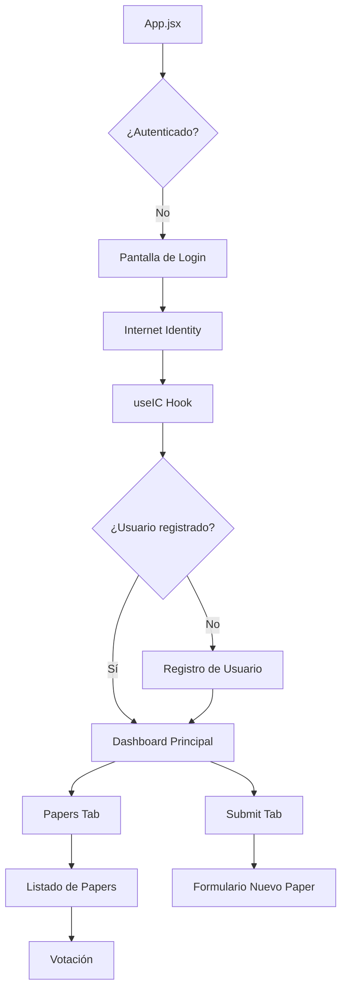

# Milo Journal Frontend - React Application

> **Frontend moderno para la plataforma académica descentralizada Milo Journal construido con React 19 y Tailwind CSS**

## 🎯 Descripción

Interface de usuario moderna y responsiva para Milo Journal, una plataforma descentralizada de publicación académica. Construida con React 19, Tailwind CSS y integración completa con Internet Computer Protocol (ICP).

## 🛠️ Stack Tecnológico

| Tecnología | Versión | Descripción |
|------------|---------|-------------|
| **React** | 19.1.0 | Framework de UI con hooks modernos |
| **Vite** | 6.3.5 | Build tool y servidor de desarrollo |
| **Tailwind CSS** | 3.4.17 | Framework CSS utility-first |
| **Lucide React** | 0.511.0 | Biblioteca de iconos minimalista |
| **@dfinity/agent** | 2.4.1 | Cliente para Internet Computer |
| **@dfinity/auth-client** | 2.4.1 | Autenticación con Internet Identity |

## 🏗️ Arquitectura del Frontend

### Estructura de Componentes

```
src/
├── App.jsx                     # Componente principal
├── hooks/
│   └── useIC.js               # Hook para conexión ICP
├── declarations/
│   └── milo_journal_backend/  # Tipos e interfaces generadas
├── assets/                    # Recursos estáticos
├── index.css                  # Estilos globales
└── main.jsx                   # Punto de entrada
```

### Flujo de la Aplicación



## 🎨 Componentes Principales

### App.jsx
Componente raíz que maneja toda la lógica de la aplicación.

#### Estados Principales
```javascript
const [activeTab, setActiveTab] = useState('papers');     // Tab activa
const [papers, setPapers] = useState([]);                 // Lista de papers
const [userInfo, setUserInfo] = useState(null);           // Info del usuario
const [stats, setStats] = useState(null);                 // Estadísticas
const [newPaper, setNewPaper] = useState({                // Nuevo paper
  title: '', 
  content: '' 
});
const [isRegistering, setIsRegistering] = useState(false); // Estado registro
const [username, setUsername] = useState('');             // Username temporal
```

#### Funciones Clave

##### `loadData()`
Carga datos iniciales desde el backend.
```javascript
const loadData = async () => {
  if (!actor) return;
  
  try {
    const [papersResult, userResult, statsResult] = await Promise.all([
      actor.getAllPapers(),
      actor.getUserInfo(), 
      actor.getSystemStats()
    ]);

    setPapers(papersResult);
    if (userResult.ok) setUserInfo(userResult.ok);
    setStats(statsResult);
  } catch (error) {
    console.error('Error loading data:', error);
  }
};
```

##### `handleConnect()`
Inicia el proceso de conexión con Internet Computer.
```javascript
const handleConnect = async () => {
  await connect();
};
```

##### `handleRegister()`
Registra un nuevo usuario en la plataforma.
```javascript
const handleRegister = async () => {
  if (!actor || !username.trim()) return;
  
  setIsRegistering(true);
  try {
    const result = await actor.registerUser(username.trim());
    if (result.ok) {
      loadData();
    } else {
      alert(result.err);
    }
  } catch (error) {
    console.error('Error registering:', error);
    alert('Error al registrar usuario');
  } finally {
    setIsRegistering(false);
  }
};
```

##### `handleSubmitPaper()`
Envía un nuevo paper al backend.
```javascript
const handleSubmitPaper = async () => {
  if (!actor || !newPaper.title || !newPaper.content) return;

  try {
    const result = await actor.submitPaper(newPaper.title, newPaper.content);
    if (result.ok) {
      setNewPaper({ title: '', content: '' });
      loadData();
    }
  } catch (error) {
    console.error('Error submitting paper:', error);
  }
};
```

##### `handleVote()`
Registra un voto en un paper específico.
```javascript
const handleVote = async (paperId, approve) => {
  if (!actor) return;

  try {
    const result = await actor.votePaper(paperId, approve);
    if (result.ok) {
      loadData();
    }
  } catch (error) {
    console.error('Error voting:', error);
  }
};
```

### useIC Hook
Hook personalizado para la conexión con Internet Computer.

#### Ubicación
`src/hooks/useIC.js`

#### Estados del Hook
```javascript
const [actor, setActor] = useState(null);                    // Actor del backend
const [identity, setIdentity] = useState(null);              // Identidad del usuario
const [isAuthenticated, setIsAuthenticated] = useState(false); // Estado auth
```

#### Función de Conexión
```javascript
const connect = async () => {
  const authClient = await AuthClient.create();
  await authClient.login({
    identityProvider: "https://identity.ic0.app",
    onSuccess: async () => {
      const identity = await authClient.getIdentity();
      const agent = new HttpAgent({ identity });

      if (import.meta.env.DFX_NETWORK !== 'ic') {
        await agent.fetchRootKey(); // Solo en local
      }

      const actor = Actor.createActor(idlFactory, {
        agent,
        canisterId
      });

      setIdentity(identity);
      setActor(actor);
      setIsAuthenticated(true);
    }
  });
};
```

## 🎨 Sistema de Diseño

### Paleta de Colores

| Color | Clase Tailwind | Uso |
|-------|----------------|-----|
| **Azul Principal** | `blue-600` | Botones primarios, iconos |
| **Púrpura** | `purple-600` | Gradientes, acentos |
| **Verde** | `green-500` | Estados aprobados, success |
| **Rojo** | `red-500` | Estados rechazados, error |
| **Amarillo** | `yellow-500` | Estados en proceso |
| **Gris** | `gray-900` | Texto principal |
| **Gris Claro** | `gray-50` | Backgrounds |

### Componentes de UI

#### Header
```jsx
<header className="bg-white shadow-sm border-b">
  <div className="max-w-7xl mx-auto px-4 py-4">
    <div className="flex items-center justify-between">
      <div className="flex items-center space-x-3">
        <FileText className="w-8 h-8 text-blue-600" />
        <h1 className="text-2xl font-bold text-gray-900">Milo Journal</h1>
      </div>
      
      {/* Wallet Info */}
      <div className="flex items-center space-x-4">
        <div className="flex items-center space-x-2 bg-blue-50 px-3 py-2 rounded-lg">
          <Wallet className="w-5 h-5 text-blue-600" />
          <span className="font-semibold text-blue-800">{userInfo.walletAmount} $INV</span>
        </div>
      </div>
    </div>
  </div>
</header>
```

#### Stats Cards
```jsx
<div className="grid grid-cols-1 md:grid-cols-3 gap-6 mb-8">
  <div className="bg-white rounded-xl p-6 shadow-sm border">
    <div className="flex items-center justify-between">
      <div>
        <p className="text-gray-600 text-sm">Total Papers</p>
        <p className="text-2xl font-bold text-gray-900">{stats.totalPapers}</p>
      </div>
      <FileText className="w-12 h-12 text-blue-500" />
    </div>
  </div>
</div>
```

#### Paper Card
```jsx
<div className="border rounded-lg p-6 hover:shadow-md transition-shadow">
  <div className="flex items-start justify-between mb-4">
    <div className="flex-1">
      <h3 className="text-xl font-semibold text-gray-900 mb-2">{paper.title}</h3>
      <p className="text-gray-600 mb-2">by {paper.author}</p>
      <p className="text-gray-700 text-sm line-clamp-3">{paper.content}</p>
    </div>
    <div className="flex flex-col items-end space-y-2 ml-4">
      <span className={`px-3 py-1 rounded-full text-xs font-medium ${getStatusColor(paper.status)}`}>
        {getStatusText(paper.status)}
      </span>
      <span className="text-sm text-gray-500">Votes: {paper.votes}</span>
    </div>
  </div>
  
  {/* Voting Buttons */}
  <div className="flex items-center space-x-4 pt-4 border-t">
    <button
      onClick={() => handleVote(paper.id, true)}
      className="flex items-center space-x-2 px-4 py-2 bg-green-50 text-green-700 rounded-lg hover:bg-green-100 transition-colors"
    >
      <ThumbsUp className="w-4 h-4" />
      <span>Approve</span>
    </button>
    <button
      onClick={() => handleVote(paper.id, false)}
      className="flex items-center space-x-2 px-4 py-2 bg-red-50 text-red-700 rounded-lg hover:bg-red-100 transition-colors"
    >
      <ThumbsDown className="w-4 h-4" />
      <span>Reject</span>
    </button>
  </div>
</div>
```

## 🚀 Desarrollo

### Instalación

```bash
# Desde el directorio del frontend
cd src/milo_journal_frontend

# Instalar dependencias
npm install

# Iniciar servidor de desarrollo
npm run dev
```

### Scripts Disponibles

```bash
npm run dev          # Servidor de desarrollo (localhost:5173)
npm run build        # Build para producción
npm run preview      # Preview del build
npm run lint         # Linting con ESLint
```

### Variables de Entorno

El frontend está configurado para trabajar automáticamente con:

| Variable | Valor | Descripción |
|----------|-------|-------------|
| `DFX_NETWORK` | `local` / `ic` | Red de IC (definida por Vite) |
| `CANISTER_ID_MILO_JOURNAL_BACKEND` | Auto | ID del canister backend |

### Configuración Vite

```javascript
// vite.config.js
export default defineConfig({
  plugins: [react()],
  define: {
    global: 'globalThis',
    'process.env': {},
    'process.env.DFX_NETWORK': JSON.stringify(process.env.DFX_NETWORK || 'local'),
    'process.env.CANISTER_ID_MILO_JOURNAL_BACKEND': JSON.stringify(
      process.env.CANISTER_ID_MILO_JOURNAL_BACKEND || 'vb2j2-fp777-77774-qaafq-cai'
    ),
  },
  server: {
    proxy: {
      '/api': {
        target: 'http://127.0.0.1:8000',
        changeOrigin: true,
      },
    },
  }
});
```

## 🎯 Funcionalidades

### Autenticación
- **Internet Identity**: Autenticación descentralizada segura
- **Registro de usuario**: Flujo guiado para nuevos usuarios
- **Gestión de sesión**: Persistencia de estado de autenticación

### Dashboard
- **Métricas en tiempo real**: Total papers, usuarios, aprobaciones
- **Navegación por tabs**: Papers y Submit Paper
- **Wallet integrado**: Visualización de balance $INV

### Gestión de Papers
- **Listado completo**: Todos los papers con filtrado visual
- **Estados dinámicos**: Colores diferenciados por estado
- **Votación intuitiva**: Botones de aprobar/rechazar
- **Formulario de envío**: Interface limpia para nuevos papers

### UI/UX
- **Responsive Design**: Funciona en desktop y mobile
- **Loading States**: Feedback visual durante operaciones
- **Error Handling**: Manejo elegante de errores
- **Animaciones**: Transiciones suaves y hover effects

## 🔧 Integración con Backend

### Conexión ICP
El frontend se conecta al backend Motoko a través de:

1. **@dfinity/agent**: Cliente HTTP para IC
2. **@dfinity/auth-client**: Autenticación con Internet Identity
3. **Candid Interface**: Tipos generados automáticamente
4. **Actor Pattern**: Llamadas asíncronas al canister

### Flujo de Datos
```
React Component → useIC Hook → Actor → Motoko Canister
      ↓              ↓          ↓           ↓
  UI Update ← State Update ← Response ← Backend Logic
```

## 🧪 Testing

### Testing Manual

1. **Flujo de Autenticación**:
   ```bash
   # Abrir aplicación
   npm run dev
   # → Click "Conectar con Internet Computer"
   # → Autenticarse con Internet Identity
   # → Registrar usuario
   # → Verificar dashboard
   ```

2. **Publicación de Paper**:
   ```bash
   # → Click tab "Submit Paper"
   # → Llenar título y contenido
   # → Click "Submit Paper Proposal"
   # → Verificar deducción de 100 tokens
   ```

3. **Sistema de Votación**:
   ```bash
   # → Cambiar a otro usuario
   # → Votar en paper disponible
   # → Verificar recompensa de 50 tokens
   # → Verificar cambio de estado del paper
   ```

### Debug y Desarrollo

```javascript
// Logging en consola
console.log('Papers loaded:', papers);
console.log('User info:', userInfo);
console.log('Actor connected:', actor);

// Error handling
try {
  const result = await actor.someMethod();
} catch (error) {
  console.error('Error calling backend:', error);
}
```

## 📱 Responsive Design

### Breakpoints Tailwind

| Breakpoint | Clase | Ancho |
|------------|-------|-------|
| **sm** | `sm:` | ≥ 640px |
| **md** | `md:` | ≥ 768px |
| **lg** | `lg:` | ≥ 1024px |
| **xl** | `xl:` | ≥ 1280px |

### Adaptaciones Mobile
- **Grid responsive**: `grid-cols-1 md:grid-cols-3`
- **Spacing adaptativo**: `px-4 py-8`
- **Typography escalable**: `text-xl md:text-2xl`
- **Navigation colapsible**: Menu hamburguesa en móviles

## 🚀 Deployment

### Build de Producción
```bash
npm run build
```

### Integración con DFX
El frontend se despliega automáticamente como canister de assets:

```json
// dfx.json
{
  "milo_journal_frontend": {
    "dependencies": ["milo_journal_backend"],
    "frontend": {
      "entrypoint": "src/milo_journal_frontend/src/index.html"
    },
    "source": ["src/milo_journal_frontend/assets", "src/milo_journal_frontend/"],
    "type": "assets"
  }
}
```

## 🔍 Troubleshooting

### Errores Comunes

| Error | Causa | Solución |
|-------|-------|----------|
| "process is not defined" | Vite config | Agregar polyfills en vite.config.js |
| "Actor not connected" | Backend down | Verificar `dfx start` y `dfx deploy` |
| "Authentication failed" | II issues | Limpiar cache y reconectar |
| "Network error" | Canister ID | Verificar IDs en declarations |

### Debug Steps
1. Verificar que dfx esté corriendo: `dfx ping`
2. Confirmar deploy de backend: `dfx canister id milo_journal_backend`
3. Revisar logs de consola en DevTools
4. Probar conexión manual: `dfx canister call ...`

---

**Milo Journal Frontend v1.0.0** - Interface moderna para publicación académica descentralizada.

*Última actualización: Enero 2025*